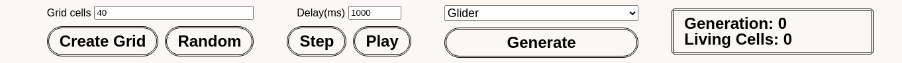
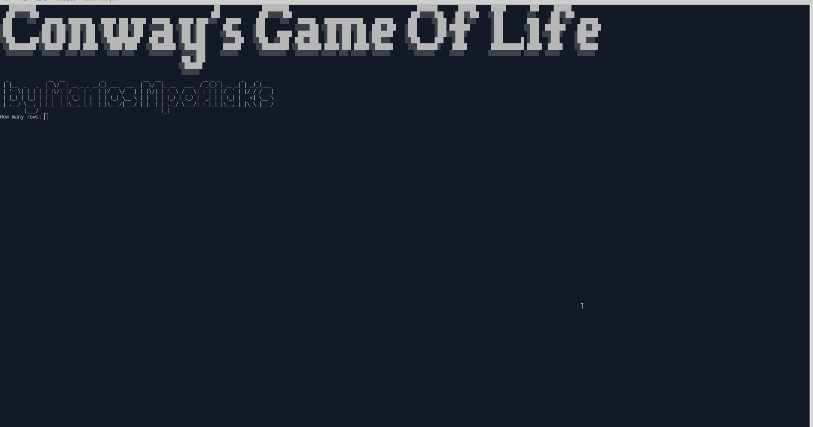
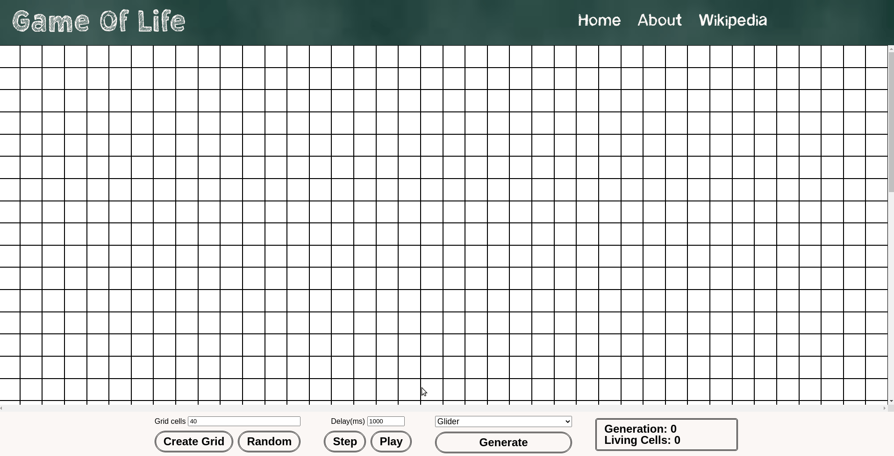

# Conway's Game Of Life
A website demonstrating the famous Game of Life. Game of Life is a zero player cellular automata game that was invented by the late English mathematician [John Horton Conway](https://en.wikipedia.org/wiki/John_Horton_Conway).

## Rules
* The player sets up the board(initial state) by adding or removing living cells on it(represented by black squares).
* After the initial setup the game simulates the life of those cells following these rules:
  * Any cell with fewer than 2 neighbors die from isolation
  * Any cell with exactly two or three neighbors lives on to the next generation.
  * Any cell with more than 3 neighbors dies from overpopulation.
  * Any dead cell with exactly three neighbors becomes alive through birth.

## Features

* The player can choose the site of the board by changing the Grid cells value. A board can be as small as 10x10 or as big as 100x100 cells.
* The player can create the initial state himself by manually adding or removing cells on the board or they can get a randomized initial state by pressing the random key. The random state can also be edited manually after generation.
* The dropdown menu provides a number of interesting board setups for the player to demo. This can be used by selecting the preferred setup and then pressing generate. After that the player can run the game or edit the predefined state themselves.
* The player can have the game auto-advance through the generations by pressing play or go through each generation manually by pressing the step button.
* Delay(ms) controls how quickly generations change when the play button is pushed.
* When the play button is pushed for a second time, simulation will be stopped and can be resumed as initially.
* The generation and living cells counters will automatically keep track of the state of the board.
* At any time the player can reset the game by creating a new empty grid, a new random grid or by selecting a predefined state from the dropdown.

If you would like to know more about the game of life please visit the about page on the website.

## Command-line version

We also provide a command line version of the game if you would like to try that out.

In order to use this you need to install [node.js](https://nodejs.org/en/).

After you do download the cmdVersion folder, navigate to it and run the following command:

`node commandGOL.js`

Note that the command line script only allows for randomly generated boards.

## About

The web project was made by using pure HTML5, CSS3 and Javascript (ES6). It demonstrates the use of grid in combination with aspect-ratio to generate the play area.

The Command line version is made with Javascript (ES6). [Readline](https://nodejs.org/api/readline.html) is used to get IO in the command line. [Figlet](https://github.com/patorjk/figlet.js/) is used to create the splash screen.

Images in the about page are taken from [wikipedia](https://www.wikipedia.org/).

# Demo

